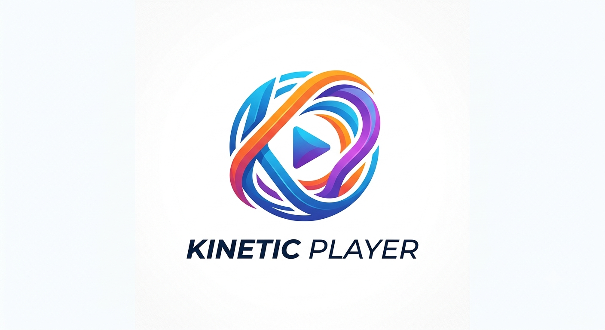
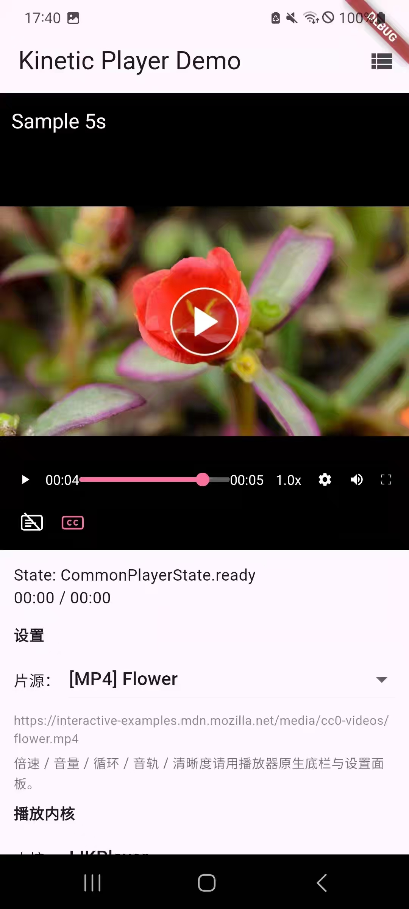
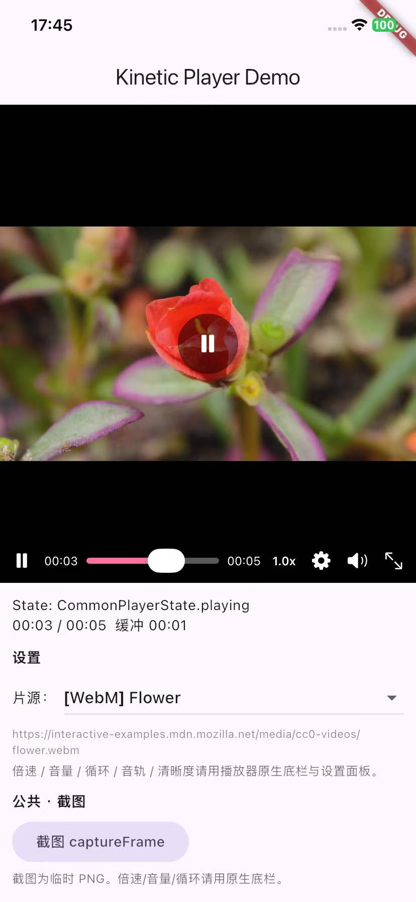
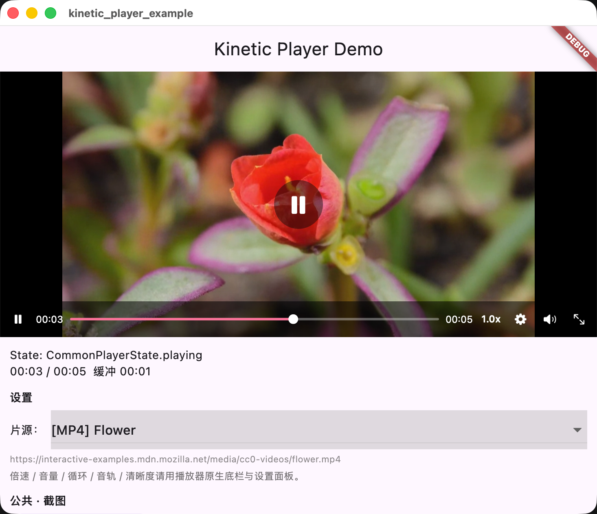
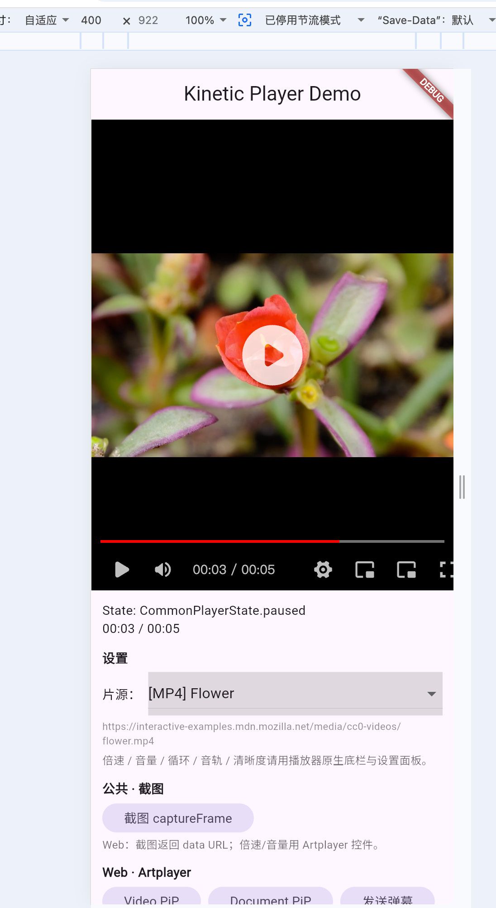

<p align="center">
  
</p>

# kinetic_player

English version: [README_EN.md](README_EN.md)

最强大的跨平台 Flutter 视频播放器插件：**Android** 使用 [GSYVideoPlayer 13.1.0](https://github.com/CarGuo/GSYVideoPlayer)，**iOS / macOS** 使用 [wanwenfeng4798/SGPlayer](https://github.com/wanwenfeng4798/SGPlayer)（master），**Web** 使用 [Artplayer.js 5.4.0](https://artplayer.org)，**Windows / Linux** 使用 [libmpv](https://mpv.io)。

仓库：[github.com/wanwenfeng4798/kinetic_player](https://github.com/wanwenfeng4798/kinetic_player)

需要 **Dart 3.12 / Flutter 3.44+**，并依赖 `material_ui: ^1.1.0`。

## 平台预览

| Android | iOS |
|:-------:|:---:|
|  |  |

| macOS | Web |
|:-----:|:---:|
|  |  |

## 特性

- 统一的 `CommonVideoController` API（播放 / 暂停 / 跳转 / 缩放 / 倍速 / 音量 / 音轨 / 循环 / 截图等）
- 平台自动选型：Android → GSY，iOS / macOS → SGPlayer，Web → Artplayer，**Windows / Linux → libmpv**
- B 站风格原生控制栏：竖向音量弹窗（拖动显示百分比）、设置面板（音轨 / 截图；Android 含 GIF）、弹窗淡入淡出、统一进度条与底栏图标尺寸
- **Android / iOS** 支持滑动手势调进度 / 音量 / 亮度（`enableNativeControls`）；**macOS / Windows / Linux** 无滑动手势，用进度条 + 喇叭/齿轮按钮
- Android 画中画（PiP）**默认开启**（API 26+；播放中切后台自动进入，含 GSY 自动播放场景）
- Web：Video / Document PiP、HLS/DASH、官方 Artplayer 插件（弹幕 / 字幕 / Chromecast 等）
- Android GSY：弹幕/水印/广告/滤镜等高级能力见 [doc/GSY_FEATURES.md](doc/GSY_FEATURES.md)（内嵌与窗口全屏一致）
- 独有功能通过显式向下转型调用（不污染公共接口）
- iOS / macOS 经 **sharedDarwinSource**（`darwin/`）同时支持 **CocoaPods** 与 **Swift Package Manager (SPM)**
- 预编译 `SGPlayer.xcframework` 可通过 **GitHub Release** 下载，避免本地编译

## 文档

| 文档 | 说明 |
|------|------|
| [doc/USAGE.md](doc/USAGE.md) | 集成步骤、公共 API、原生 UI、平台差异、PiP 配置 |
| [doc/GSY_FEATURES.md](doc/GSY_FEATURES.md) | Android GSY 高级能力对照表 |
| [doc/DARWIN_SGPLAYER.md](doc/DARWIN_SGPLAYER.md) | iOS / macOS SGPlayer：二进制、脚本、SPM、Release |
| [doc/WEB_ARTPLAYER.md](doc/WEB_ARTPLAYER.md) | Web Artplayer：插件、HLS/DASH、Web 独有 API、打包 |
| [doc/DESKTOP_MPV.md](doc/DESKTOP_MPV.md) | Windows / Linux libmpv：依赖、DLL、Wayland、hwdec |
| [doc/EXAMPLE.md](doc/EXAMPLE.md) | Example 应用说明 |

## 快速开始

### 1. 添加依赖

```yaml
dependencies:
  kinetic_player:
    path: ../kinetic_player   # 或 pub.dev / git 引用
```

### 2. 启用 Apple SPM（推荐，iOS / macOS）

在应用与插件 `pubspec.yaml` 中：

```yaml
flutter:
  config:
    enable-swift-package-manager: true
```

### 3. iOS / macOS（通常无需额外步骤）

详见 [doc/DARWIN_SGPLAYER.md](doc/DARWIN_SGPLAYER.md)。

**SPM（推荐）：** 插件已随包发布 `Package.swift` + 源码；Xcode 解析时按远程 `binaryTarget` 自动下载 `SGPlayer.xcframework`。macOS 请将 `MACOSX_DEPLOYMENT_TARGET` 设为 **11.0+**。若 Xcode 直编报包装包版本冲突，见 [DARWIN_SGPLAYER.md](doc/DARWIN_SGPLAYER.md#spm-包装包最低版本) 手动修改 `FlutterGeneratedPluginSwiftPackage`。

**CocoaPods：** `pod install` 经 `prepare_command` 调用 `ensure_sgplayer.sh`（下载预编译；失败再本地编译）。

维护者更新 Release / manifest 后重生成 `Package.swift`，或强制本地编译，见 Darwin 文档。

### 4. 最小示例

```dart
import 'package:kinetic_player/kinetic_player.dart';

CommonVideoPlayerViewBuilder(
  url: 'https://example.com/video.mp4',
  creationParams: {
    ...const KineticUiConfig(
      showVolumeToolbar: true,
      showSettingsButton: true,
      pictureInPictureEnabled: true, // Android only
      locale: 'zh',
    ).toCreationParams(),
  },
  builder: (controller) {
    // controller 为 CommonVideoController，可按平台向下转型
  },
);
```

完整示例见 [doc/EXAMPLE.md](doc/EXAMPLE.md) 与 `example/` 目录。

## HDR 测试链接

为避免重复维护，HDR 测试流统一维护在独立文档：

- 中文： [doc/HDR_TEST_LINKS.md](doc/HDR_TEST_LINKS.md)
- English: [doc/HDR_TEST_LINKS_EN.md](doc/HDR_TEST_LINKS_EN.md)

## 内核选型

按目标平台选内核即可；**Windows / Linux 已内建 libmpv**，不必再引入 GstPlayer。

| 目标平台 | 选用内核 | 说明 |
|----------|----------|------|
| Android | GSYVideoPlayer | 默认自动选型 |
| iOS / macOS | SGPlayer | 默认自动选型 |
| Web | Artplayer.js | 默认自动选型 |
| **Windows / Linux** | **libmpv** | 默认自动选型；详见 [doc/DESKTOP_MPV.md](doc/DESKTOP_MPV.md) |

若你更需要 GStreamer 管线，仍可选用独立包 [GstPlayer](https://pub.dev/packages/gstplayer)。

## 平台支持

| 平台 | 内核 | 真机 / 桌面 | 模拟器 / 浏览器 | 画中画 |
|------|------|-------------|-----------------|--------|
| Android | GSYVideoPlayer 13.1.0 | ✅ | ✅ | ✅ 默认开启 |
| iOS | SGPlayer master | ✅ | ❌（FFmpeg 预编译仅 arm64 真机） | ❌ |
| macOS | SGPlayer master | ✅ | ✅（`macosx` xcframework） | ❌ |
| Web | Artplayer.js 5.4.0 | — | ✅ Chrome / Safari / 移动 Web | ✅ Video PiP；Document PiP 可选 |
| Windows | libmpv（打包 DLL） | ✅ x64 | — | ❌ |
| Linux | libmpv（系统库） | ✅ | — | ❌ |

## 许可证

本插件代码采用 [MIT License](LICENSE)。

SGPlayer 为独立第三方项目，其许可证以 [wanwenfeng4798/SGPlayer](https://github.com/wanwenfeng4798/SGPlayer) 仓库为准（fork 自 libobjc/SGPlayer）。

Windows 预编译 **libmpv** 为 LGPLv2.1+ 动态链接（见 [doc/DESKTOP_MPV.md](doc/DESKTOP_MPV.md)）。

## 支持

如果你觉得这个项目对你有帮助请支持我


